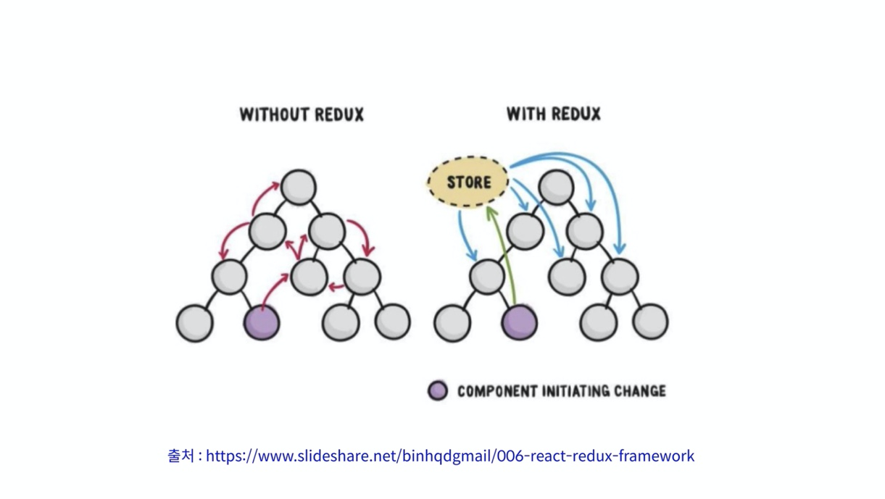

# React Redux 관련 정리
[공식문서 : https://react-redux.js.org/](https://react-redux.js.org/)

## history
* react
  - 컴포넌트를 이용하여 체계적으로 애플리케이션을 만들게 해주는 기술.
  - 상태값 관리를 각 컴포넌트에서 관리하여 props로 넘겨주는 방식이어서 한계가 있음.
* 그래서 redux
  - 상태값을 중앙에서 관리하는 기술.
  - 
  - redux만 사용하면 필요하지 않은 모든 컴포넌트에도 store가 전달된다는 단점.
  - 각 컴포넌트마다 store가 연결되어서 props가 필요없고 상태관리가 간편한데 props를 받아 처리하는게 아니라서 상태값 의존적이고 부품으로써의 재사용성이 떨어짐
  - 각 컴포넌트에서 비동기 호출 및 성공,실패,요청 등을 다 코딩 해줘야 하므로 문제.
* 그래서 redux를 이용한 Presentational Component, Container Component로 나눠서 처리
  - 무조건 나눌필요는 없음 (상황에 맞게)
  - Container Component
    - redux, 애플리케이션종속작업 및 다른 로직처리
  - Presentational Component
    - 화면처리 역할에 집중.
  - 단점 : 코드가 많아지고 할일이 또 생김(dispatch, subscribe하고 props로 전달하고...)
* 그래서 react-redux (npm i react-redux)
  - 상태값 변경에 대한 소식이 필요한 컴포넌트에만 정보를 전달할 수 있음.
  - 그 컴포넌트만 render함수 실행.
  - store를 자식 컴포넌트에 계속 물려주지 않아도 됨.
```javascript
// redux만 사용한코드===================================
import {createStore} from 'redux';
import reducers from './reducers';

const store = createStore(reducers); // 만든 리듀서를 store에 연결.

ReactDOM.render(
  <App store={store} />,  // root App에 store를 바로 연결
  document.getElementById('root'),
);

store.subscribe(render);
```
```javascript
// react-redux사용한코드===================================
import {createStore} from 'redux';
import {Provider} from 'react-redux';
import reducers from './reducers';

const store = createStore(reducers); // 만든 리듀서를 store에 연결.

ReactDOM.render(
  <Provider store={store}>  // react-redux의 Provider컴포넌트에 store연결
    <App store={store} />
  </Provider>,
  document.getElementById('root'),
);

store.subscribe(render);
```

## mapStateToProps사용
* 컴포넌트의 props와 store의 실제 state값과 연결시켜주는 역할.
  - 연결된 상태값은 값 변경을 감지하여 컴포넌트의 props에 반영됨.
```javascript
import React, {Component} from 'react'
import {connect} from 'react-redux'
import AddButton from './AddButton'
import SubButton from './SubButton'

class App extends Component {
  render() {
    return (
      <div className="App">
        <span>{this.props.number}</span><br/>
        <AddButton/><SubButton/>
      </div>
    );
  }
}

let mapStateToProps = (state, /*ownProps*/) => {
  return {
    number: state.data.number, // 연결
  };
};

App = connect(mapStateToProps, null)(App);

export default App;
```
## connect()
* 파라미터: connect(mapStateToProps?: Function, mapDispatchToProps?: Function, mergeProps?: Function, option?: Object)
* 사용하지 않는 파라미터는 null이나 undefined.
```javascript
import { connect } from 'react-redux'
import { increment, decrement, reset } from './actionCreators'

// const Counter = ...

const mapStateToProps = (state /*, ownProps*/) => {
  return {
    counter: state.counter
  }
}

const mapDispatchToProps = { increment, decrement, reset }

export default connect(
  mapStateToProps,
  mapDispatchToProps
)(Counter)
```
